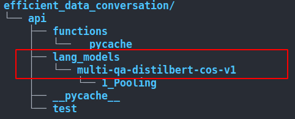

## Efficient Data Conversation ##

Chat with your data while uploading a pdf file and using a local LLM.

### Table of Contents ###

* [PDF File Structure Support](#pdf_structure)
* [Language Support](#language_support)
* [Key Dependencies](#key_dependencies)
* [Setup Guidelines](#setup_guidelines)
* [System Support](#system_support)
* [Credits](#credits)

#### PDF File Structure Support: <a name="pdf_structure"></a> ####

1. Files with well organized tables i.e.: a single row/column ins not divided in multi row/column
2. Usually Research Paper Structure:
    * Abstract
    * Intorduction
    * Background Works
    * Dataset
    * Methodology
    * Result Analysis
    * Discussion
    * Future Works
    * Conclusion
3. No Image support for now
4. Up coming: meta data support

#### Language Support: <a name="language_support"></a> ####

1. English
2. Others are loading...

#### Key Dependencies: <a name="key_dependencies"></a> ####

* [Ollama](https://ollama.com/blog/ollama-is-now-available-as-an-official-docker-image) with or without GPU
* Sentence-transformers
* Langchain

The models in use:

1. Attempted Sentence Embedding, chosen on mainly MTEB leaderboard and personal experience:
    * [multi-qa-distilbert-cos-v1](https://huggingface.co/sentence-transformers/multi-qa-distilbert-cos-v1)
    * [multi-qa-mpnet-base-dot-v1](https://huggingface.co/sentence-transformers/multi-qa-mpnet-base-dot-v1)
    * [e5-base-v2](https://huggingface.co/intfloat/e5-base-v2)
    * [RobBERT](https://pieter.ai/robbert/) [**Currently, In Use**]
2. Attemtped LLMs, chosen based on [Mistral-7b](https://ollama.com/library/mistral/tags)'s acceptable performence for low resource devices:
    * Mistral-7b: instruct-v0.2-q2_K
    * Mistral-7b: instruct-v0.2-q5_K_M
    * Mistral-7b: instruct-v0.2-q6_K [**Currently, In use**]

`To store models, open a sub-directory inside the "api" directory open a directory.`

**For example: "lang_models":**



#### Setup Guidelines: <a name="setup_guidelines"></a> ###

1. OS tested: `Ubuntu>=20.04 LTS`
2. Create a `Python>=3.11` environment using conda or virtual env
3. Use the requirements file to install the dependencies:
```
pip install -r requirements.txt
```
4. Use **Ollama** docker and **Huggingface** to pull/download all the models, refer to section: **Key Dependencies** for details and where to store the models inside your machine.
5. Set the `.env` file according to the `.env.example` structure.
*Note*: For CPU inference, set `USE_GPU=0`
6. From the parent directory, to run the system, execute the command below in the termnal:
```
streamlit run api/app.py
```

#### System Support: <a name="system_support"></a> ####

1. Integrated frontend with Streamlit
2. Up-coming: Separated backend support
3. Up-coming: Docker support

#### Credits and special thanks to my friends: <a name="credits"></a> ####

1. Sharif Ahamed, MSc. in AI, University of Bradford, Bradford, United Kingdom, [Email](sharifahamed485@gmail.com):
    * For advising me through
2. Soroush Yaghoubi, BSc. In Informatics, Technical University Dortmund, Dortmund, Germany:
    * For the frontend idea and more works in future